# 🎮 PIXEL DUNGEON - COMPLETE GAME FLOW

## 📋 Table of Contents

1. [Overview](#overview)
2. [Complete Game Flow](#complete-game-flow)
3. [Technical Details](#technical-details)
4. [Payout System](#payout-system)
5. [On-Chain Transactions](#on-chain-transactions)

---

## 🎯 Overview

**Pixel Dungeon** is an on-chain betting game built on Solana, where players:
- Deposit SOL to enter dungeons
- Choose a door from 1-25
- Compete against other players
- Winner takes all the pool
- 100% on-chain, transparent and immutable system

**Main Features:**
- ⚡ Real SOL - Bets with real cryptocurrency
- 🚫 No Mercy - No refunds, irreversible system
- 🏆 Winner Takes All - Winner takes the entire prize
- 🔗 On-Chain - Everything recorded on Solana blockchain

---

## 🎮 Complete Game Flow

### **STEP 1: Initial Screen**
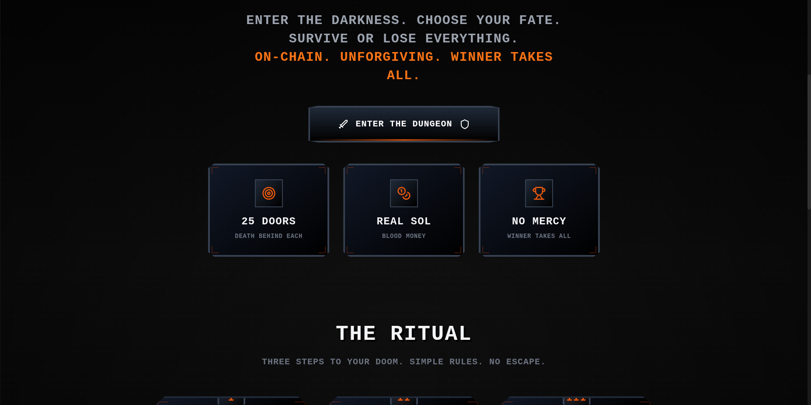

Player is greeted with a dark interface with dungeon theme:

**Visible elements:**
- Title: "ENTER THE DARKNESS. CHOOSE YOUR FATE. SURVIVE OR LOSE EVERYTHING."
- Orange subtitle: "ON-CHAIN. UNFORGIVING. WINNER TAKES ALL."
- Main button: "ENTER THE DUNGEON"

**"THE RITUAL" - Three Steps To Your Doom:**

1. **🎯 PICK YOUR DOOR**
   - "25 DOORS. ONE HIDES YOUR FATE."
   - "CHOOSE CAREFULLY OR DIE TRYING."

2. **💰 BLOOD OFFERING**
   - "DEPOSIT SOL. NO REFUNDS. NO MERCY."
   - "YOUR GOLD FEEDS THE DUNGEON."

3. **⚔️ LIVE OR DIE**
   - "WINNERS CLAIM ALL. LOSERS LEAVE WITH NOTHING BUT REGRET."

---

### **STEP 2: Connect Wallet**
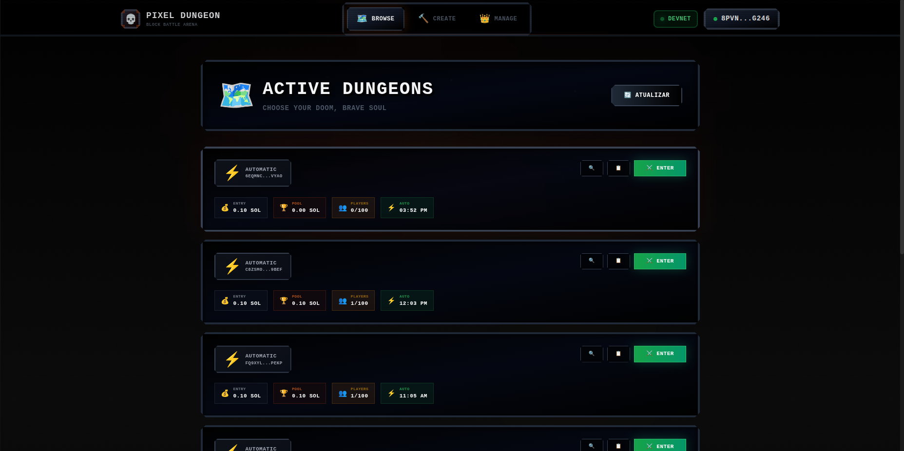

When clicking "FACE THE DARKNESS", user is prompted to connect their wallet:

**Action:**
```
"ARE YOU BRAVE ENOUGH?"
"THE DUNGEON AWAITS. CONNECT YOUR WALLET. FACE YOUR DESTINY."
→ Button: "FACE THE DARKNESS"
```

User connects their Solana wallet (Phantom, Solflare, etc.)

---

### **STEP 3: View Active Dungeons**
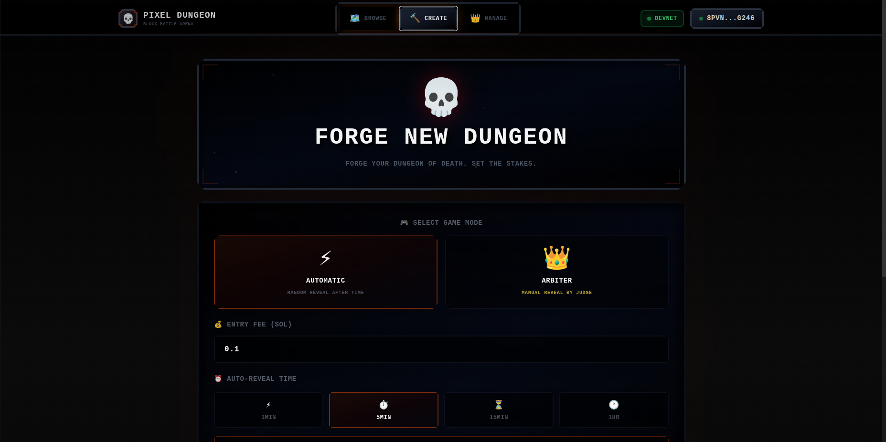

After connecting, player sees the list of available dungeons:

**Information displayed for each dungeon:**
- **Mode:** AUTOMATIC (Auto reveal after timer) or ARBITER (Manual reveal by judge)
- **💰 Entry:** Entry fee (e.g., 0.10 SOL)
- **🏆 Prize:** Total pool prize (e.g., 0.00 SOL)
- **👥 Players:** Number of players (e.g., 0/100)
- **⏰ Timer:** Reveal time (e.g., 03:52 PM)
- **Button:** "✕ ENTER" to enter the dungeon

**Example of active dungeons:**
```
AUTOMATIC | SEQWMC...YTAO
💰 0.10 SOL | 🏆 0.00 SOL | 👥 0/100 | ⏰ 03:52 PM

AUTOMATIC | CZZ0M0...6BET
💰 0.10 SOL | 🏆 0.00 SOL | 👥 1/100 | ⏰ 12:03 PM

AUTOMATIC | EQvHL...TEAM
💰 0.10 SOL | 🏆 0.00 SOL | 👥 1/100 | ⏰ 11:05 AM
```

---

### **STEP 4: Create New Dungeon**


User can create a new dungeon by clicking "CREATE":

**Available settings:**

1. **🎮 SELECT GAME MODE**
   - **AUTOMATIC:** "RANDOM REVEAL AFTER TIME" (Auto reveal after time expires)
   - **ARBITER:** "MANUAL REVEAL BY JUDGE" (Manual reveal by designated judge)

2. **💰 ENTRY FEE (SOL)**
   ```
   Input: 0.1
   ```
   Defines the amount each player must deposit to enter

3. **⏰ AUTO-REVEAL TIME**
   - **1MIN** - 1 minute
   - **5MIN** - 5 minutes ⭐ (selected)
   - **15MIN** - 15 minutes
   - **1HR** - 1 hour

4. **📊 Capacity**
   ```
   Input: 300 (maximum players)
   ```

**Important information:**
- "⚡ WINNER REVEALED AUTOMATICALLY AFTER TIMER EXPIRES"
- "✨ CREATE MULTIPLE DUNGEONS • MANAGE IN 👑 TAB"
- "⚡ WINNER AUTO-REVEALS AFTER TIME • NO ARBITER NEEDED"

**Button:** "⚔️ FORGE DUNGEON ⚔️" (green, highlighted)

---

### **STEP 5: ARBITER Mode (Alternative)**
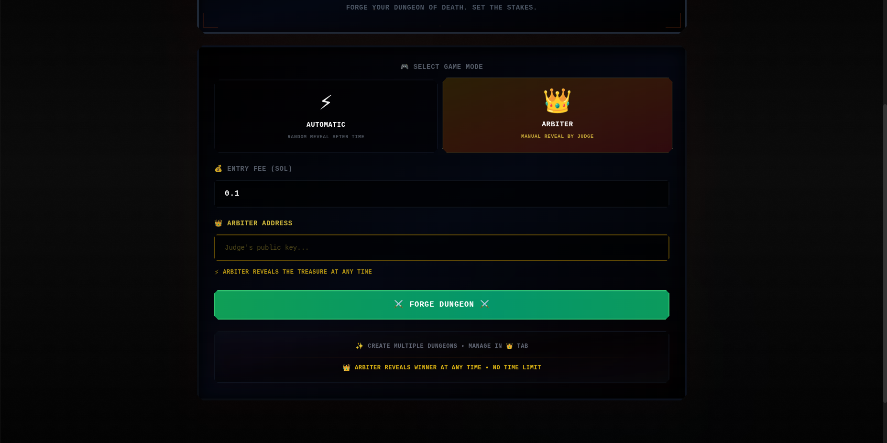

If user chooses ARBITER mode:

**Differences:**
- Requires an arbiter address (Judge)
- Additional field: **👑 ARBITER ADDRESS**
  ```
  Input: "Judge's public key..."
  ```

**Important warning:**
- "⚡ ARBITER REVEALS THE TREASURE AT ANY TIME"
- "👑 ARBITER REVEALS WINNER AT ANY TIME • NO TIME LIMIT"

The arbiter has the power to reveal the winner at any time, without time limit.

---

### **STEP 6: Confirm Creation Transaction**
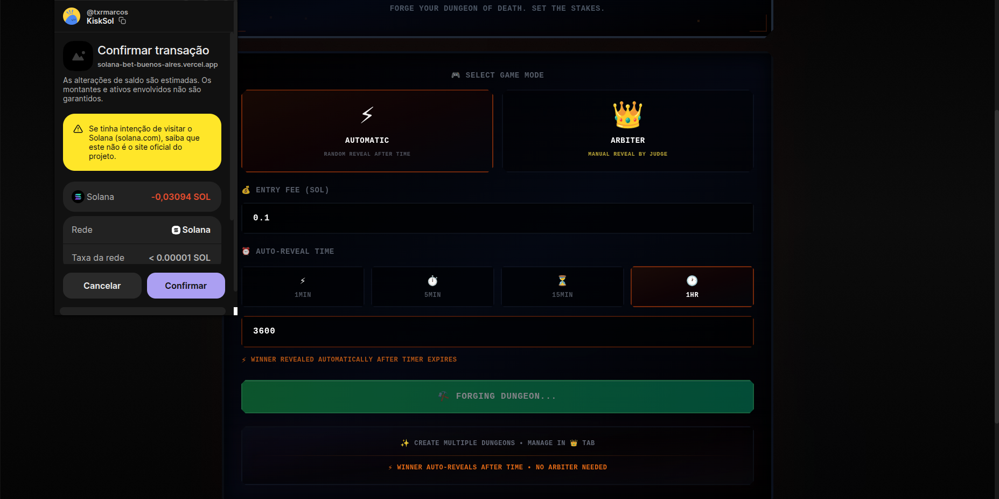

When clicking "FORGE DUNGEON", wallet requests approval:

**Phantom Wallet transaction:**
```
Confirm transaction
solana-bet-buenos-aires.vercel.app

⚠️ If you intended to visit Solana (solana.com),
    note that this is not the official project site.

Network: ⚪ Solana
Network fee: < 0.00001 SOL

[Cancel]  [Confirm]
```

**Button state:**
```
"FORGING DUNGEON..." (loading)
```

---

### **STEP 7: Dungeon Created Successfully**
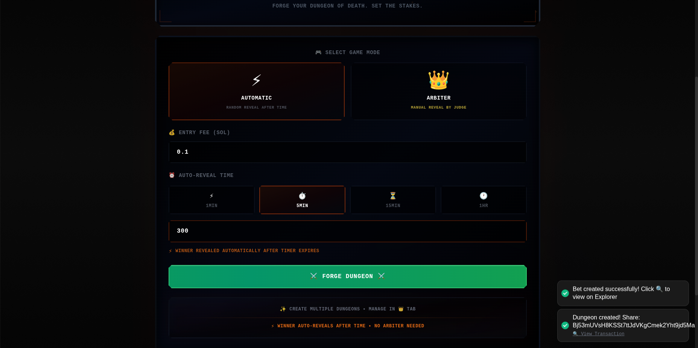

After confirmation, success notifications appear:

**Notifications (toasts):**
```
✅ Bet created successfully! Click 🔍 to view on Explorer
✅ Dungeon created! Share: Bj53mUVsH8KSS7rtJdVKqCmek2Yht9jd5MaRSjF41Fy
   👁️ View Transaction
```

Transaction is sent to blockchain and dungeon is ready to receive players.

---

### **STEP 8: View Dungeon Details in Explorer**
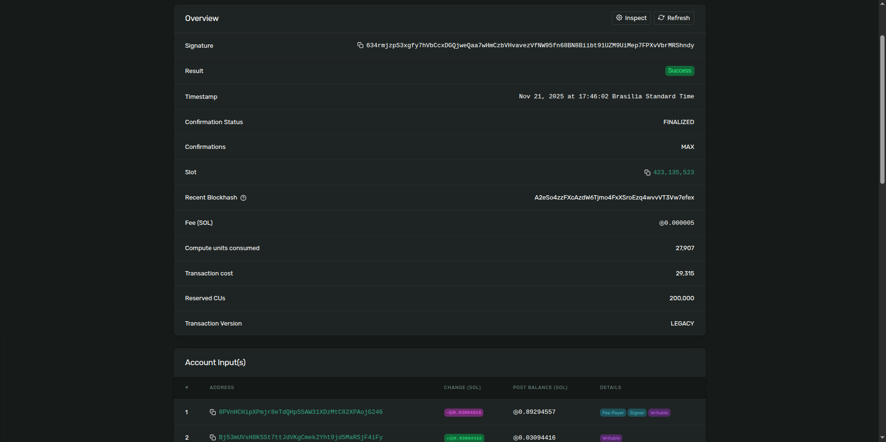

Clicking on Explorer link, we see complete transaction details:

**Transaction information:**
```
Overview
Signature: 634ra1zpS3xqfY7hVbCxDG0tweQaa7wMcZpDVyav8zYfWw95fh68BN9B1bt91UZM9Ui...
Result: Success ✅
Timestamp: Nov 21, 2025 at 17:46:02 Brasilia Standard Time
Confirmation Status: FINALIZED
Confirmations: MAX
Slot: 423,135,523
Recent Blockhash: A2eSo4zzFcAzdW6Tjm04FxXSroEzq4wwvVT3Vw7efex
Fee (SOL): @0.000005
Compute units consumed: 27007
Transaction cost: 29.315
Reserved CUs: 200,000
Transaction Version: LEGACY
```

**Account Input(s):**
```
#  ADDRESS                                          CHANGE (SOL)    POST BALANCE (SOL)  DETAILS
1  8PVnHCH1pXPmjr8eTdQHpS5AW31XDzMtC82XPAojG246  -@1.93941       @0.89294557         Fee Payer, Signer, Writable
2  Bj53mUVsH8KSS7rtJdVKqCmek2Yht9jd5MaRSjF41Fy  +@0.9394118     @0.03094416         Writable
```

**Inner Instructions:**

**#1️⃣ System Program: Create Account**
```
Program:            System Program
From Address:       8PVnHCH1pXPmjr8eTdQHpS5AW31XDzMtC82XPAojG246
New Address:        Bj53mUVsH8KSS7rtJdVKqCmek2Yht9jd5MaRSjF41Fy
Transfer Amount:    @0.03094416 SOL
Allocated Data Size: 4318 byte(s)
Assigned Program Id: Eq2TrTYgAttzSmVbjpm6t6SSBUVT5Ab2zWVTxaYDE91BF
```

**Program Instruction Logs:**
```
📝 Instruction ⚡
> Program logged: "Instruction: createBet"
> Program invoked: System Program
  > Program returned success
> Program logged: "Bet created by: 8PVnHCH1pXPmjr8eTdQHpS5AW31XDzMtC82XPAojG246"
> Program logged: "Min deposit: 100000000 lamports"
> Program logged: "Lock time: 1763761543"
> Program logged: "Arbiter: 11111111111111111111111111111111"
> Program logged: "Is automatic: true"
> Program consumed: 27007 of 200000 compute units
> Program returned success
```

---

### **STEP 9: Manage Created Dungeons**
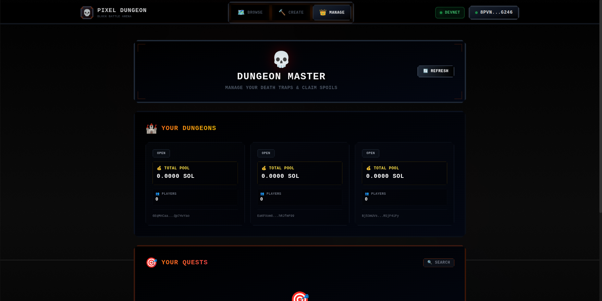

In "MANAGE" tab, creator sees their dungeons:

**Visualization:**
```
🏰 DUNGEON MASTER
MANAGE YOUR DEATH TRAPS & CLAIM SPOILS

YOUR DUNGEONS:
┌─────────────────────────────────────┐
│ OPEN                                 │
│ 💰 TOTAL POOL: 0.0000 SOL           │
│ 👥 PLAYERS: 0                        │
│ GEqmCaa...Qp7aYrao                   │
└─────────────────────────────────────┘
```

Dungeon is open and waiting for players.

---

### **STEP 10: Enter a Dungeon as Player**
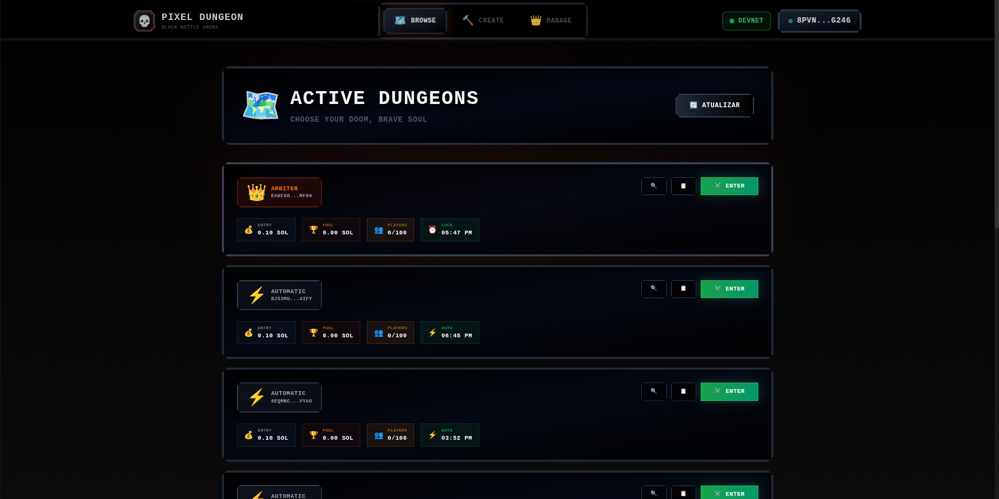

Back to "BROWSE" tab, we see available dungeons to enter:

**Example of dungeon with ARBITER mode:**
```
👑 ARBITER | EaKFXo...hRJfmF99
💰 0.10 SOL | 🏆 0.00 SOL | 👥 0/100 | ⏰ 05:47 PM
🔍 EXPLORER

[🗑️] [■] [✕ ENTER]
```

Player clicks "✕ ENTER" to participate.

---

### **STEP 11: Choose Door in ARBITER Dungeon**
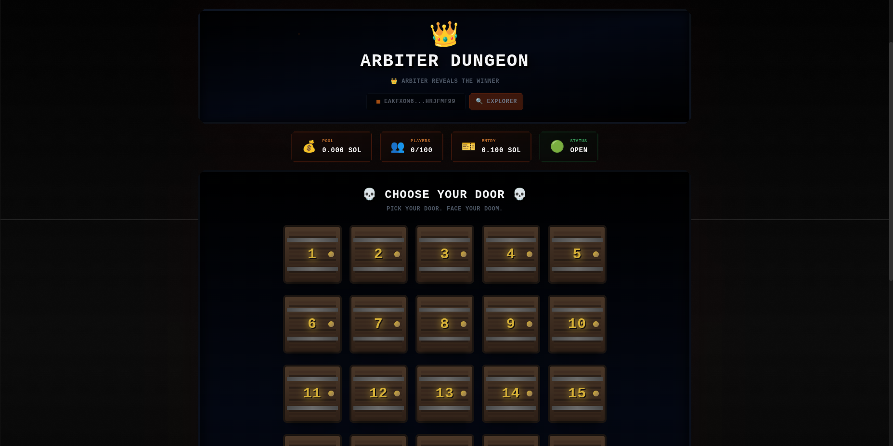

Door selection screen in ARBITER mode:

**Interface:**
```
👑 ARBITER DUNGEON
"🏆 ARBITER UNVEILS THE WINNER"

[Dungeon ID]: EaKFXom7L8y4F5J45WKwjPsXsJgFfbpLzNyR3fmF99
                🔍 EXPLORER

💰 0.00 SOL | 👥 0/100 | 💳 0.100 SOL | 🟢 OPEN

⚔️ CHOOSE YOUR DOOR ⚔️
"PICK YOUR DOOR. FACE YOUR DOOM."

[Grid of 25 doors numbered 1-25]
[Door 1] [Door 2] [Door 3] [Door 4] [Door 5]
[Door 6] [Door 7] [Door 8] [Door 9] [Door 10]
...up to door 25

DEPOSIT (SOL): 0.1
```

Player chooses a door and confirms deposit.

---

### **STEP 12: Choose Door - Visual Selection**
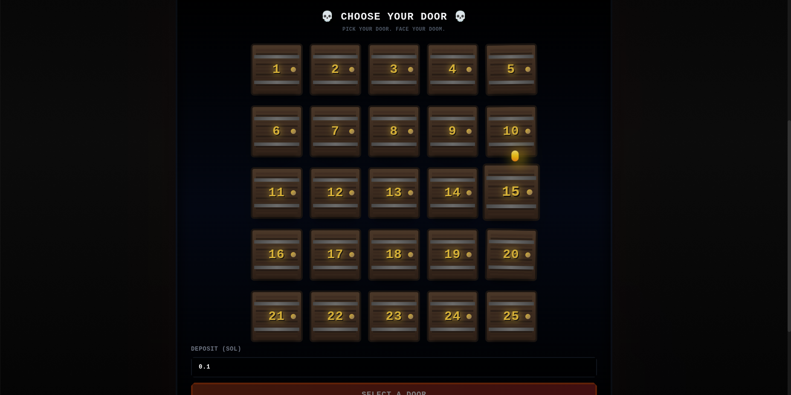

Interface shows 25 available doors:

**Door grid:**
```
[1] [2] [3] [4] [5]
[6] [7] [8] [9] [10]
[11] [12] [13] [14] [15]  ← Door 15 highlighted
[16] [17] [18] [19] [20]
[21] [22] [23] [24] [25]
```

When hovering over a door, it's highlighted. Player selects door 15.

---

### **STEP 13: Confirm Door Entry**
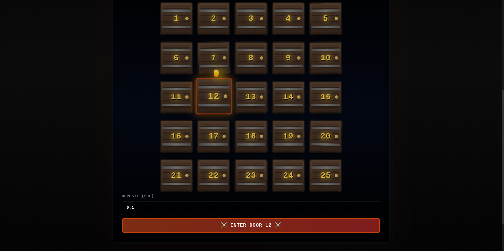

After selecting door:

**Confirmation button:**
```
🚪 ENTER DOOR 12 ⚔️
```

Player confirms their choice and proceeds to deposit.

---

### **STEP 14: Confirm Entry Transaction**
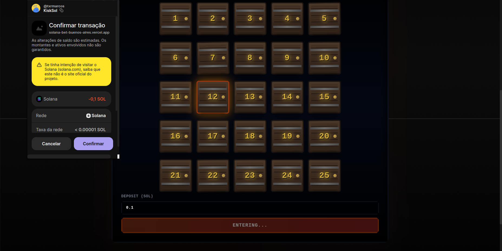

Wallet requests approval for deposit:

**Phantom Wallet transaction:**
```
Confirm transaction
solana-bet-buenos-aires.vercel.app

⚠️ If you intended to visit Solana (solana.com),
    note that this is not the official project site.

Network: ⚪ Solana
-0.1 SOL

Network fee: < 0.00001 SOL

[Cancel]  [Confirm]
```

**Button state:**
```
"ENTERING..." (loading)
```

Player confirms and transaction is sent.

---

### **STEP 15: Entry Confirmed**
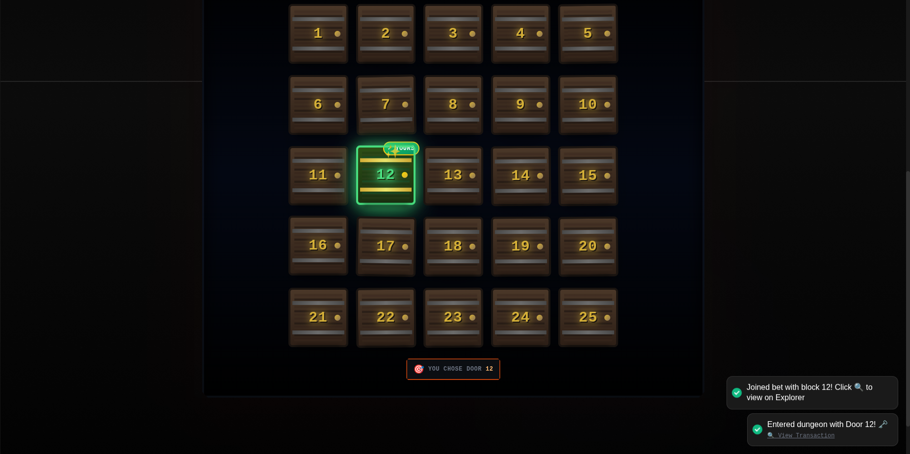

After transaction is confirmed:

**Notifications:**
```
✅ Joined bet with block 12! Click 🔍 to view on Explorer
✅ Entered dungeon with Door 12! 🔗
   👁️ View Transaction
```

**Visually selected door:**
```
[Door grid with door 12 highlighted in green]
              ✅ Victory
[11] [12✓] [13] [14] [15]

💯 YOU CHOSE DOOR 12
```

---

### **STEP 16: Entry Transaction Details**
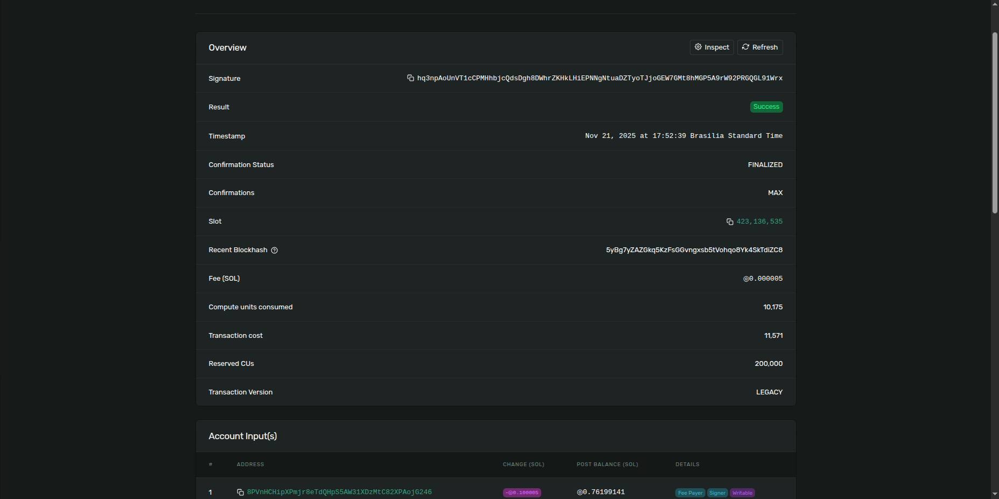

Viewing transaction in Explorer:

**"JoinBet" transaction:**
```
Overview
Signature: hq3npAoUnV1cCPMHhjcQdsDgh8DMhrZKHkLi1ELPNNgNtuaDTyoTjjoGEW7GMt8hNGP5A9...
Result: Success ✅
Timestamp: Nov 21, 2025 at 17:52:39 Brasilia Standard Time
Fee (SOL): @0.000005
Compute units consumed: 10,175
```

**Account Input(s):**
```
#  ADDRESS                                          CHANGE (SOL)    POST BALANCE (SOL)
1  8PVnHCH1pXPmjr8eTdQHpS5AW31XDzMtC82XPAojG246  -@1.1000000     @0.76199141
2  EaKFXom7L8y4F5J45WKwjPsXsJgFfbpLzNynR3fmF99  +@0.1          @0.03094416
```

**Inner Instructions:**

**#1️⃣ System Program: Transfer**
```
Program:        System Program
From Address:   8PVnHCH1pXPmjr8eTdQHpS5AW31XDzMtC82XPAojG246
To Address:     EaKFXom7L8y4F5J45WKwjPsXsJgFfbpLzNynR3fmF99
Transfer Amount: @0.1 SOL
```

**Program Instruction Logs:**
```
📝 Instruction ⚡
> Program logged: "Instruction: JoinBet"
> Program invoked: System Program
  > Program returned success
> Program logged: "Player 8PVnHCH1pXPmjr8eTdQHpS5AW31XDzMtC82XPAojG246 joined with block 12 and 100000000 lamports"
> Program logged: "Total pool: 100000000 lamports"
> Program logged: "Total players: 1"
> Program consumed: 10175 of 200000 compute units
> Program returned success
```

**Transaction summary:**
- Player deposited **0.1 SOL**
- Chose **door 12**
- Total pool now: **0.1 SOL**
- Total players: **1**

---

### **STEP 17: Second Player Enters**
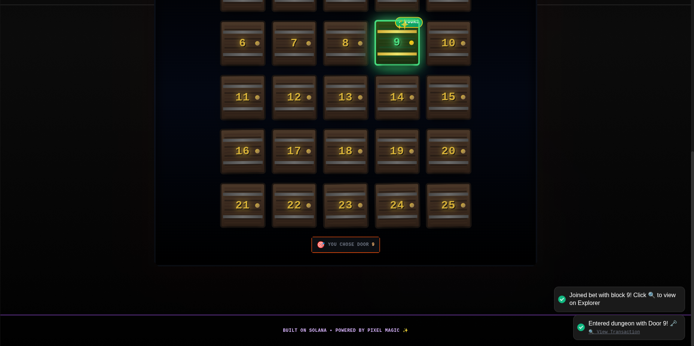

A second player enters dungeon choosing door 9:

**Notification:**
```
✅ Joined bet with block 9! Click 🔍 to view on Explorer
✅ Entered dungeon with Door 9! 🔗
   👁️ View Transaction

💯 YOU CHOSE DOOR 9
```

Now we have:
- **Player 1:** Door 12
- **Player 2:** Door 9
- **Total pool:** 0.2 SOL

---

### **STEP 18: View Dungeon with Multiple Players**
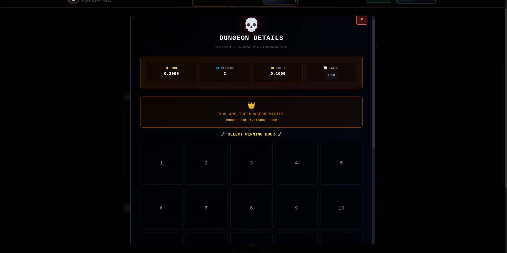

In dungeon details screen:

**Updated status:**
```
EaKFXom7L8y4F5J45WKwjPsXsJgFfbpLzNynR3fmF99

💰 POOL: 0.2000 | 👥 PLAYERS: 2 | 💳 ENTRY: 0.1000 | 📊 STATUS: OPEN
```

**Dungeon Master section:**
```
👑 YOU ARE THE DUNGEON MASTER
   CHOOSE THE TREASURE DOOR

⚔️ SELECT WINNING DOOR ⚔️

[Grid of 25 doors]
[1] [2] [3] [4] [5]
...
```

As creator (arbiter), you can choose which door will be revealed as winner.

---

### **STEP 19: Arbiter Selects Winning Door**
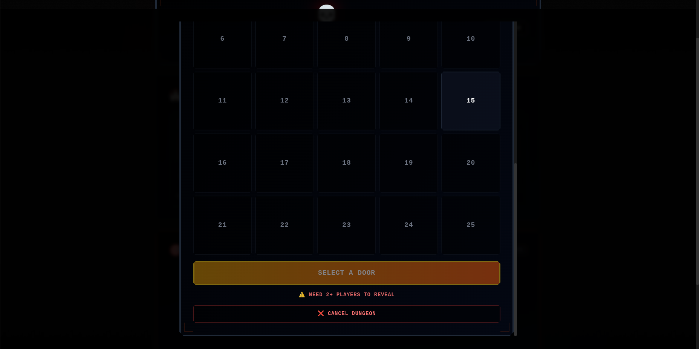

Arbiter selects door 15 as winner:

**Interface:**
```
[Grid with door 15 selected]

[⚔️ SELECT A DOOR]

⚠️ NEED 2+ PLAYERS TO REVEAL
```

Since there are 2 players (minimum requirement met), arbiter can proceed.

---

### **STEP 20: Confirm Reveal**
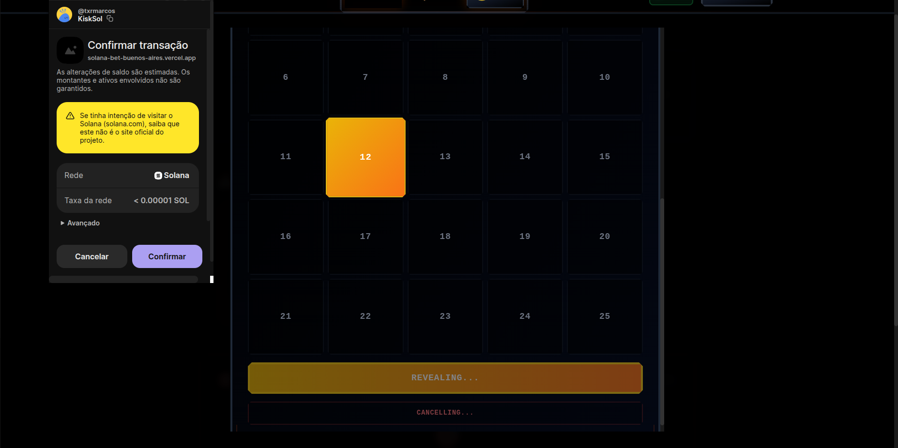

Arbiter confirms reveal transaction:

**Phantom Wallet:**
```
Confirm transaction
solana-bet-buenos-aires.vercel.app

Network: ⚪ Solana
Network fee: < 0.00001 SOL

[Cancel]  [Confirm]
```

**Button state:**
```
"REVEALING..." (loading)
```

---

### **STEP 21: Door Revealed - Treasure Found!**
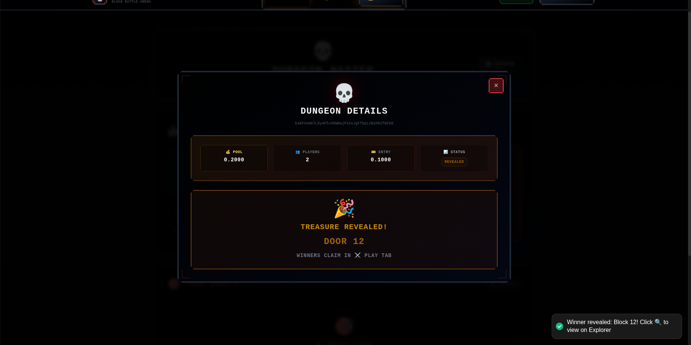

After reveal, victory screen appears:

**Interface:**
```
DUNGEON DETAILS
EaKFXom7L8y4F5J45WKwjPsXsJgFfbpLzNynR3fmF99

💰 POOL: 0.2000 | 👥 PLAYERS: 2 | 💳 ENTRY: 0.1000 | 📊 STATUS: REVEALED

┌─────────────────────────────────────┐
│         🎉💰                         │
│    TREASURE REVEALED!                │
│       DOOR 12                        │
│                                      │
│ WINNERS CLAIM IN ⚔️ PLAY TAB        │
└─────────────────────────────────────┘
```

**Notification:**
```
✅ Winner revealed: Block 12! Click 🔍 to view on Explorer
```

Door 12 was revealed as winner! Player who chose this door can claim prize.

---

### **STEP 22: View Revealed Dungeons**
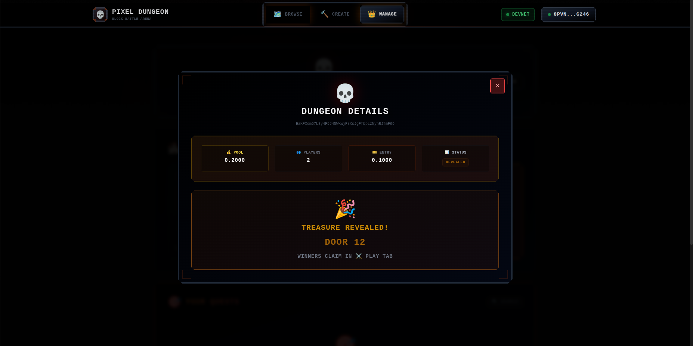

In general view, dungeon now shows REVEALED status:

**Dungeon status:**
```
🏰 YOUR DUNGEONS

┌─────────────────────────────────────┐
│ REVEALED                     🎉     │
│ 💰 TOTAL POOL: 0.2000 SOL           │
│ 👥 PLAYERS: 2    🏆 WINNER: #12     │
│ EaKFXom...hRJfmF99                  │
└─────────────────────────────────────┘
```

Winner can now claim prize.

---

### **STEP 23: View Quests (Participations)**
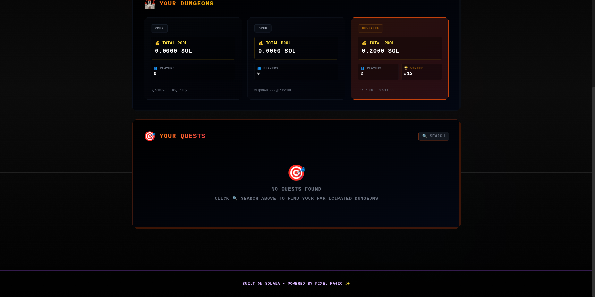

In "YOUR QUESTS" tab, winner sees their participations:

**Statistics dashboard:**
```
🎯 YOUR QUESTS

💎 TOTAL INVESTED: 0.2000 SOL
💰 TOTAL WON: 0.2000 SOL
💵 NET PROFIT: +0.0000 SOL
🎲 WIN RATE: 2/2 (100%)
```

**Individual quests:**

**Quest 1:**
```
REVEALED            🏆 VICTORY
💎 INVESTED: 0.1000 SOL | 💰 WINNINGS: 0.2000 SOL
🚪 YOUR DOOR: 21 | 🏆 WINNER: 21
👥 ADVENTURERS: 2

✅ TREASURE CLAIMED
YOU WON 0.2000 SOL!
PROFIT: +0.1000 SOL

HmYfGeEB...kQ6Lz4Mq
```

**Quest 2:**
```
REVEALED            🏆 VICTORY
💎 INVESTED: 0.1000 SOL | 💰 WINNINGS: 0.2000 SOL
🚪 YOUR DOOR: 12 | 🏆 WINNER: 12
👥 ADVENTURERS: 2

💰 CLAIM TREASURE 💰

EaKFXom...hRJfmF99
```

Player can click "💰 CLAIM TREASURE 💰" to claim prize.

---

### **STEP 24: Claim Prize**
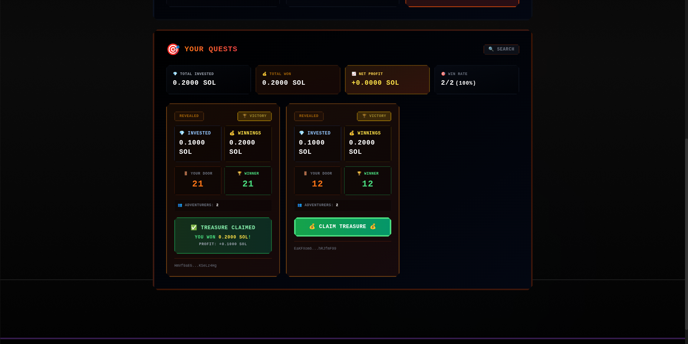

When clicking "CLAIM TREASURE":

**Phantom Wallet:**
```
Confirm transaction
solana-bet-buenos-aires.vercel.app

Network: ⚪ Solana
+0.2 SOL (net gain)

Network fee: < 0.00001 SOL

[Cancel]  [Confirm]
```

**Loading:**
```
📊 LOADING DUNGEON DATA...
THIS MAY TAKE A FEW SECONDS
```

Player confirms and receives prize.

---

### **STEP 25: Prize Claimed Successfully!**
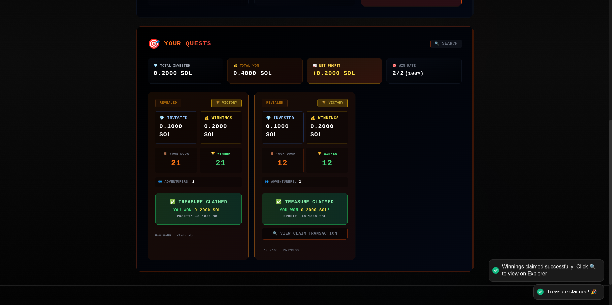

After confirmation:

**Notifications:**
```
✅ Winnings claimed successfully! Click 🔍 to view on Explorer
✅ Treasure claimed! 🎉
   👁️ View Transaction
```

**Updated quest status:**
```
REVEALED            🏆 VICTORY
💎 INVESTED: 0.1000 SOL | 💰 WINNINGS: 0.2000 SOL
🚪 YOUR DOOR: 12 | 🏆 WINNER: 12
👥 ADVENTURERS: 2

✅ TREASURE CLAIMED
YOU WON 0.2000 SOL!
PROFIT: +0.1000 SOL

[🔍 VIEW CLAIM TRANSACTION]

EaKFXom...hRJfmF99
```

Player successfully received **0.2 SOL** (0.1 back + 0.1 profit).

---

### **STEP 26: Claim Transaction in Explorer**


Claim transaction details:

**"claimWinnings" transaction:**
```
Instruction
Unknown Program (Eq2TrTYgAttzSmVbjpm6t6SSBUVT5Ab2zWVTxaYDE91BF): Unknown Instruction

Program:     Eq2TrTYgAttzSmVbjpm6t6SSBUVT5Ab2zWVTxaYDE91BF
Account #1:  EaKFXom7L8y4F5J45WKwjPsXsJgFfbpLzNynR3fmF99 (Writable)
Account #2:  8PVnHCH1pXPmjr8eTdQHpS5AW31XDzMtC82XPAojG246 (Writable, Signer)

Instruction Data (Hex): a1 d7 10 3b 0c 9c f2 dd
```

**Account Changes:**
```
#  ADDRESS                                          CHANGE (SOL)    POST BALANCE (SOL)
1  8PVnHCH1pXPmjr8eTdQHpS5AW31XDzMtC82XPAojG246  +@2.199095      @0.96198141
2  EaKFXom7L8y4F5J45WKwjPsXsJgFfbpLzNynR3fmF99  -@0.2           @0.03094416
3  Eq2TrTYgAttzSmVbjpm6t6SSBUVT5Ab2zWVTxaYDE91BF  0               @0.00114144
```

**Program Instruction Logs:**
```
📝 Instruction ⚡
> Program logged: "Instruction: claimWinnings"
> Program invoked: System Program
  > Program returned success
> Program logged: "Player 8PVnHCH1pXPmjr8eTdQHpS5AW31XDzMtC82XPAojG246 won! Claiming 200000000 lamports"
> Program logged: "Share: 100000000/100000000 of total pool"
> Program consumed: 8170 of 200000 compute units
> Program returned success
```

**Summary:**
- Player received **0.2 SOL** (200000000 lamports)
- Share: 100% of pool (was the only winner)
- Net profit: **+0.1 SOL** (doubled investment)

---

### **STEP 27: Final Dashboard**
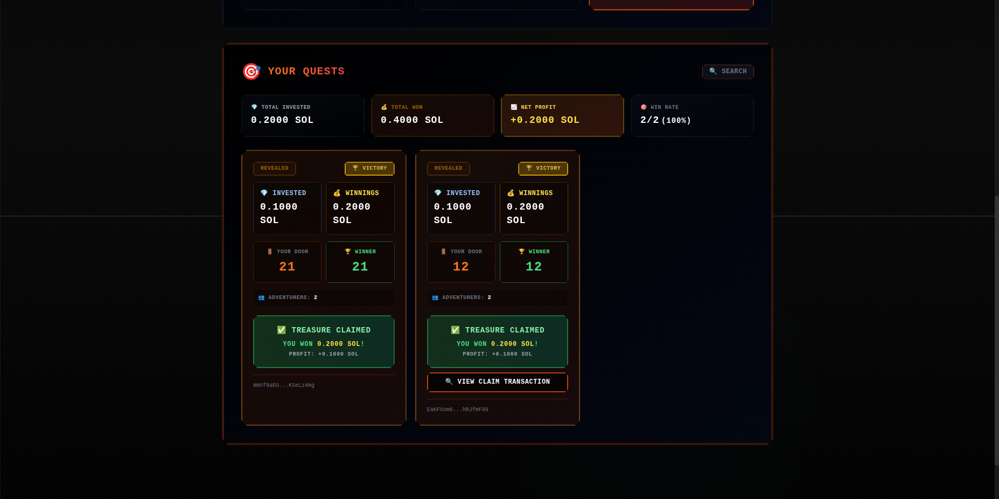

Final quests view:

**Updated statistics:**
```
💎 TOTAL INVESTED: 0.2000 SOL
💰 TOTAL WON: 0.4000 SOL
💵 NET PROFIT: +0.2000 SOL
🎲 WIN RATE: 2/2 (100%)
```

**Both quests completed:**
```
Quest 1: ✅ TREASURE CLAIMED - YOU WON 0.2000 SOL! PROFIT: +0.1000 SOL
Quest 2: ✅ TREASURE CLAIMED - YOU WON 0.2000 SOL! PROFIT: +0.1000 SOL
```

Player succeeded in both participations, doubling their investment in each!

---

## 🔧 Technical Details

### **Smart Contract Architecture**

**Main instructions:**

1. **`createBet`**
   - Creates a new dungeon (bet)
   - Defines parameters: entry fee, lock time, arbiter, mode
   - Allocates account space (4318 bytes)
   - Initializes data structure

2. **`joinBet`**
   - Player enters existing dungeon
   - Transfers entry fee to bet account
   - Records chosen door (chosen_block)
   - Updates player count and total pool

3. **`revealBet`** (for ARBITER mode)
   - Arbiter selects winning door
   - Marks bet as REVEALED
   - Allows winners to claim prizes

4. **`claimWinnings`**
   - Calculates winner's proportional payout
   - Transfers SOL from bet account to winner
   - Marks player as "claimed"

### **Bet Data Structure**

```rust
pub struct Bet {
    pub creator: Pubkey,           // Dungeon creator
    pub arbiter: Pubkey,           // Arbiter (or null address if automatic)
    pub min_deposit: u64,          // Entry fee in lamports
    pub lock_time: i64,            // Unix timestamp for auto reveal
    pub is_automatic: bool,        // true = AUTOMATIC, false = ARBITER
    pub total_pool: u64,           // Total accumulated pool
    pub player_count: u8,          // Number of players
    pub players: [Pubkey; 100],    // Player list
    pub deposits: [u64; 100],      // Each player's deposit
    pub chosen_blocks: [u8; 100],  // Chosen doors (1-25)
    pub winning_block: u8,         // Winning door
    pub is_revealed: bool,         // Reveal status
    pub claimed: [bool; 100],      // Players who claimed
}
```

### **Fund Flow**

1. **Creation:**
   - Creator pays rent to allocate account (~0.03 SOL)

2. **Entry:**
   - Each player transfers entry fee to bet account
   - Pool accumulates: `total_pool += deposit`

3. **Claim:**
   - Winners claim proportionally
   - Formula: `payout = (total_pool × player_deposit) / total_winner_deposits`

---

## 💰 Payout System

### **Proportional Distribution Formula**

```rust
let payout = (bet.total_pool as u128)
    .checked_mul(player_deposit as u128)
    .unwrap()
    .checked_div(total_winner_deposits as u128)
    .unwrap() as u64;
```

### **Practical Examples**

#### **Example 1: Two Players, One Winner**

**Setup:**
```
Player A: 0.1 SOL on door 12 ← WINNER
Player B: 0.1 SOL on door 9
```

**Reveal:** Door 12

**Payout calculation:**
```
total_pool = 0.2 SOL
player_deposit = 0.1 SOL
total_winner_deposits = 0.1 SOL (only Player A)

payout = (0.2 × 0.1) / 0.1 = 0.2 SOL
```

**Result:**
- Player A receives: **0.2 SOL** (profit of +0.1 SOL, 100% ROI)
- Player B receives: **0 SOL** (loses everything)

#### **Example 2: Two Winners, Same Door**

**Setup:**
```
Player A: 0.1 SOL on door 12 ← WINNER
Player B: 0.1 SOL on door 12 ← WINNER
Player C: 0.1 SOL on door 9
```

**Reveal:** Door 12

**Payout calculation:**
```
total_pool = 0.3 SOL
total_winner_deposits = 0.2 SOL (A + B)

Player A: (0.3 × 0.1) / 0.2 = 0.15 SOL
Player B: (0.3 × 0.1) / 0.2 = 0.15 SOL
```

**Result:**
- Player A receives: **0.15 SOL** (profit of +0.05 SOL, 50% ROI)
- Player B receives: **0.15 SOL** (profit of +0.05 SOL, 50% ROI)
- Player C receives: **0 SOL** (loses everything)

#### **Example 3: Single Winner with Larger Deposit**

**Setup:**
```
Player A: 0.5 SOL on door 12 ← WINNER
Player B: 0.1 SOL on door 9
Player C: 0.1 SOL on door 5
```

**Reveal:** Door 12

**Payout calculation:**
```
total_pool = 0.7 SOL
player_deposit = 0.5 SOL
total_winner_deposits = 0.5 SOL (only Player A)

payout = (0.7 × 0.5) / 0.5 = 0.7 SOL
```

**Result:**
- Player A receives: **0.7 SOL** (profit of +0.2 SOL, 40% ROI)
- Players B and C receive: **0 SOL** (lose everything)

### **Payout System Characteristics**

✅ **Proportional:** Higher deposit = higher prize
✅ **Fair:** Same door = same ROI%
✅ **No leftovers:** Entire pool is distributed
✅ **Secure:** Uses 128-bit arithmetic to prevent overflow
✅ **Immutable:** Cannot be changed after reveal

---

## 🔗 On-Chain Transactions

### **1. Create Bet Transaction**

**Instruction:** `createBet`

**Accounts involved:**
- Creator (signer, writable): Pays rent
- Bet Account (writable): New account created
- System Program: For allocation

**Parameters:**
- `min_deposit`: Entry fee in lamports
- `lock_time`: Unix timestamp (AUTOMATIC mode)
- `arbiter`: Arbiter's Pubkey (ARBITER mode)
- `is_automatic`: bool

**Logs:**
```
> Program logged: "Bet created by: [creator_pubkey]"
> Program logged: "Min deposit: [lamports]"
> Program logged: "Lock time: [timestamp]"
> Program logged: "Arbiter: [arbiter_pubkey or 1111...1111]"
> Program logged: "Is automatic: [true/false]"
```

### **2. Join Bet Transaction**

**Instruction:** `joinBet`

**Accounts involved:**
- Player (signer, writable): Pays entry fee
- Bet Account (writable): Receives deposit
- System Program: For transfer

**Parameters:**
- `chosen_block`: Chosen door (1-25)
- `deposit_amount`: Amount in lamports

**Logs:**
```
> Program logged: "Player [player_pubkey] joined with block [N] and [lamports] lamports"
> Program logged: "Total pool: [lamports]"
> Program logged: "Total players: [N]"
```

### **3. Reveal Bet Transaction**

**Instruction:** `revealBet`

**Accounts involved:**
- Arbiter (signer): Authorizes reveal
- Bet Account (writable): Updates status

**Parameters:**
- `winning_block`: Winning door (1-25)

**Logs:**
```
> Program logged: "Bet revealed! Winning block: [N]"
```

### **4. Claim Winnings Transaction**

**Instruction:** `claimWinnings`

**Accounts involved:**
- Winner (signer, writable): Receives prize
- Bet Account (writable): Sends prize
- System Program: For transfer

**Logs:**
```
> Program logged: "Player [player_pubkey] won! Claiming [lamports] lamports"
> Program logged: "Share: [player_deposit]/[total_winner_deposits] of total pool"
```

---

## 📊 Statistics and Metrics

### **Per Player Metrics**

**Total Invested:** Sum of all entry fees paid
```rust
total_invested = Σ deposits
```

**Total Won:** Sum of all prizes claimed
```rust
total_won = Σ payouts
```

**Net Profit:** Net profit
```rust
net_profit = total_won - total_invested
```

**Win Rate:** Victory rate
```rust
win_rate = victories / total_games
```

### **Per Dungeon Metrics**

**Pool Size:** Total accumulated value
```rust
pool = Σ player_deposits
```

**Player Count:** Number of participants
```rust
players = count(unique players)
```

**Average Deposit:** Average deposit
```rust
avg_deposit = pool / players
```

---

## 🎯 Conclusion

**Pixel Dungeon** offers a complete on-chain betting experience:

1. ✅ **Total transparency:** All transactions on blockchain
2. ✅ **Mathematical fairness:** Proportional payout system
3. ✅ **Flexibility:** AUTOMATIC and ARBITER modes
4. ✅ **Security:** Auditable smart contract
5. ✅ **Intuitive UX:** Immersive dark theme interface

**Differentiators:**
- 🎲 25 doors to choose from (greater variety)
- 👑 Arbiter mode for custom games
- ⏰ Auto-reveal for quick games
- 💰 Proportional system (not pure winner-takes-all)
- 🔗 Fully on-chain (no centralized backend)

---

## 📸 Image References

All images referenced in this document:
- `images/image-1.png` through `images/image-40.png`

Check project images directory to view complete screenshots.

---

**Built with ⚡ on Solana Blockchain**
**Powered by Pixel Magic 💀**
